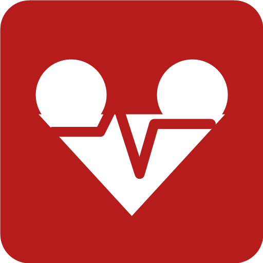

[English](README.md) · [简体中文](README.zh-CN.md) · [日本語](README.ja-JP.md)

<div align="center">



# Silema · Are You Dead Yet?（死んだ？）

**高齢者ヘルスガード · 命のリスク警告 · ワンタップ SOS**

[](https://github.com/Morningstar202604/areyoudeadyet/actions/workflows/ci.yml)
[](https://github.com/Morningstar202604/areyoudeadyet/releases)
[](LICENSE)

*「もっと水を飲んで」「早く寝て」といった曖昧なアドバイスではなく、危険な時に警告し、今すぐ何をすべきかを伝えます。*

**[最新 APK をダウンロード](https://github.com/Morningstar202604/areyoudeadyet/releases/latest)** · [リモート同期設定](docs/remote-setup.md) · [コントリビュート](#コントリビュート)

</div>

---

## このアプリの存在理由

市販の高齢者向け健康アプリには共通の欠陥があります：**危機感がない**こと。バイタルが基準値を外れても「安静にして、水を飲んで」としか言わず、*どれだけ危険か*、*今すぐ何をすべきか*を教えてくれません。このアプリはそれを逆転させます：

> すべてのアラートは3つの質問に答えます：**何が問題か / なぜ危険か / 今すぐ何をすべきか。**  
> 何もなかったふりをするより、警告しすぎる方がいい。

---

## 主な機能

| 機能 | 説明 |
|---------|-------------|
| 🚨 **リスクエンジン** | 医療閾値による4段階トリアージ（正常/注意/警告/危険）。複合ルールで隠れた危険を検出（例：低血圧＋頻脈＝ショック代償）。 |
| 📈 **統計レイヤー** | 個人ベースライン z-score 異常検出、最小二乗法トレンド回帰、MAP、ショック指数（SI）、脈圧（PP）— 数式はすべて公開。 |
| 👨‍👩‍👧 **ローカルデータエクスポート** | バイタルを FHIR R4 健康記録ファイルとしてエクスポートし、家族や医師と共有（LocalExportSync 経由）。リアルタイム遠隔監視にはエンタープライズバックエンドが必要。 |
| 🤖 **オンデバイス AI 分析** | RiskEngine ルールベース推論により完全オフラインで実行（リスクスコア/所見/推奨事項）。クラウドモデル不要（LocalAiAnalyzer で実装）。 |
| 🏥 **医療統合** | FHIR R4 標準エクスポート、病院の HIS/EHR システムと互換。ワンタップ健康レポート生成。 |
| ❤️ **カメラ PPG** | 指先＋フラッシュで 30 秒間の光学式心拍数＆HRV（RMSSD）測定。信号品質が低い場合は数値を出さない。 |
| ⌚ **Bluetooth LE** | 標準プロファイル対応：心拍数ベルト（0x180D）、血圧計（0x1810）、パルスオキシメーター（0x1822）。IEEE-11073 SFLOAT パース。 |
| 📲 **Health Connect 同期** | Health Connect 経由で華為/Xiaomi ウェアラブルデータを統合。 |
| 🏃 **GPS アクティビティ** | 歩行/ランニングのリアルタイム軌跡、距離、ペース、カロリー（フォアグラウンドサービス＋通知制御、オフライン軌跡描画）。 |
| 📊 **週間健康レポート** | 前週と対比する指標別比較＋一言サマリー＋ワンタップ家族共有。 |
| 😴 **睡眠トラッキング** | 手動の就寝/起床記録と自動時間計算、週間統計に含める。 |
| 😮‍💨 **ストレス指数** | PPG による HRV（RMSSD）ベースの対数線形推定、0–100 段階。 |
| ⏰ **スマートリマインダー** | WorkManager 測定リマインダー（当日測定完了で自動ミュート）＋長時間座りがちアラート（毎日 9:00–21:00）。 |
| 🆘 **ワンタップ SOS** | フルスクリーン緊急呼出：119番通報／家族連絡／バイタル付き SMS 送信。 |
| 🗣️ **高齢者優先 UI** | 大きなフォント、高コントラスト、76dp 以上の大きなボタン、危険レベルの自動音声アナウンス。 |
| 🔒 **オフラインファースト** | オフラインでも完全機能。リモート同期はオプション。データプライバシーはユーザーが管理。 |

### デュアルエンドアーキテクチャ

| 端 | 役割 | 対象ユーザー | モジュール | minSdk | 状態 |
|-----|------|-------------|--------|--------|--------|
| **Wear OS ウォッチ** | **メイン製品** | 高齢の装着者 | `:wear` | 30 | ✅ 5 画面が `:core` を呼び出し |
| **Android スマホ** | **ガーディアン専用** | 家族の介護者 | `:app` | 26 | ✅ 新設計、自用画面なし |

共有：`com.silema.app.core`（Kotlin-JVM ピュアライブラリ）— `RiskEngine` / `Stats` / `HealthReport` / `FhirExporter` / データモデル。スマホとウォッチで共有し、ルールエンジンの重複実装なし。

---

## プラグイン可能バックエンドアーキテクチャ

エンタープライズ展開向け：

- **サーバーは提供しません**。App とインターフェース仕様、設定ドキュメントのみ提供します。
- 企業は独自のバックエンド（Alibaba Cloud、Tencent Cloud、または自社ホスト）を接続できます。
- 詳細は[リモートセットアップガイド](docs/remote-setup.md)をご覧ください。

---

## アルゴリズムとモデル

```
ルール層   医療閾値ルール + 複合ルール + 連続3回超過で自動エスカレーション
統計層    z-score = (x-μ)/σ          個人ベースライン異常検出（14日間ウィンドウ）
           最小二乗回帰勾配           トレンド警告（21日間平均）
           MAP = DBP + (SBP-DBP)/3    <65 臓器灌流不足
           SI  = HR / SBP             ≥1.0 顕性ショックの証拠
           PP  = SBP - DBP            ≥65 動脈硬化シグナル
信号層    PPG：スライディング平均除去 → 適応型ピーク検出（ローカル μ+0.6σ、280ms 不応期）
          → HR = 60000/median(IBI)、RMSSD = √mean(ΔIBI²)
プロトコル IEEE-11073 16ビット SFLOAT：value = m(12ビット2の補数) × 10^e(4ビット2の補数)
```

---

## クイックスタート

### 前提条件
- Android Studio Hedgehog (2023.1.1) 以降
- JDK 17
- Android SDK Platform 34（Android 14）

### ビルドと実行

```bash
git clone https://github.com/Morningstar202604/areyoudeadyet.git
cd areyoudeadyet

# Android Studio で開いて Run、またはコマンドラインからビルド：
./gradlew :app:assembleDebug    # スマホガーディアンアプリ
./gradlew :wear:assembleDebug   # Wear OS メイン製品
```

### 初回セットアップ
1. ガーディアン画面で「**7日間デモデータを読み込む**」をタップすると全機能を体験できます（ワンタップで消去可能）。
2. 華為/Xiaomi バンド：運動健康アプリで Health Connect 同期を有効にしてから、ガーディアン画面でデータを取得。
3. リモート同期：`app/src/main/assets/remote_config.json` を編集。詳細は[セットアップガイド](docs/remote-setup.md)。

---

## ダウンロード

**[最新リリース APK](https://github.com/Morningstar202604/areyoudeadyet/releases/latest)** · Android 8.0+ · MIT ライセンス

> 健康管理の参考情報のみ — 医療機器ではありません。緊急時には必ず現地の救急サービスに連絡してください。

---

## コントリビュート

PR 歓迎！特に募集中：
- デバイスプロトコル対応の追加（グルコースメーター、体温計、体重計）
- 転倒検知アルゴリズム
- 言語サポートの追加（韓国語、スペイン語、フランス語など）
- HarmonyOS ArkTS 版
- クラウドベンダー向け RemoteSync 実装（AWS、Azure、GCP）

小さなステップ：Fork → ブランチ → 変更（`test/` のアルゴリズムテストをパス）→ PR。

---

## 免責事項

このアプリは公開されている医学的コンセンサス閾値に基づく健康管理の参考情報です。**医療機器による専門的な診断の代わりにはなりません。** 緊急時には必ず現地の救急サービスに連絡してください。

---

<div align="center">

**高齢者ケアのために** · [GitHub](https://github.com/Morningstar202604/areyoudeadyet) · [Issues](https://github.com/Morningstar202604/areyoudeadyet/issues) · [Releases](https://github.com/Morningstar202604/areyoudeadyet/releases)

</div>