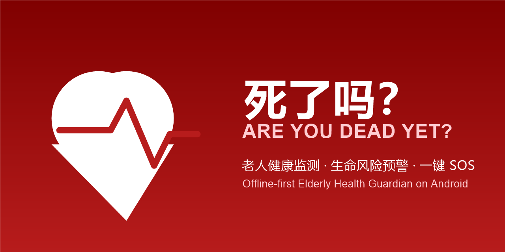

<div align="center">


# Silema · Are You Dead Yet? (死了吗？)

**Elderly Health Guardian · Life Risk Warning · One-Tap SOS**  
**老人健康监测 · 生命风险预警 · 一键 SOS**

[](https://github.com/Morningstar202604/areyoudeadyet/actions/workflows/ci.yml)
[](https://github.com/Morningstar202604/areyoudeadyet/releases)
[](https://developer.android.com)
[](https://developer.android.com/wear)
[](https://kotlinlang.org)
[](https://developer.android.com/jetpack/compose)
[](LICENSE)
[](https://github.com/Morningstar202604/areyoudeadyet/stargazers)

*No more vague "drink water, sleep early" advice — we warn you when it's dangerous and tell you exactly what to do.*  
*拒绝「多喝水早睡觉」式空泛建议 —— 有危险就大声警告，并告诉你现在该做什么。*

**[Download Latest APK](https://github.com/Morningstar202604/areyoudeadyet/releases/latest)** · [中文文档](#chinese) · [日本語](#japanese) · [Algorithm Details](#algorithms--models) · [Remote Setup](docs/remote-setup.md) · [Contribute](#contributing)



</div>

---

## 🌍 Multi-Language Support / 多语言支持 / マルチ言語対応

This app supports **English**, **简体中文**, and **日本語**. Switch language in your Android system settings.  
本应用支持**英文**、**简体中文**和**日本語**。在 Android 系统设置中切换语言即可。  
このアプリは**英語**、**簡体字中国語**、**日本語**をサポートしています。Android システム設定で言語を切り替えてください。

---

## Why This App Exists

Most elderly health apps suffer from the same flaw: **no sense of crisis**. When vitals go out of range, they just say "rest more, drink water" — never telling you *how dangerous it is* or *what to do right now*. We flip that:

> Every alert must answer three questions: **What's wrong? Why is it dangerous? What to do NOW?**  
> Better over-warn than pretend everything's fine.

市面上的老人健康 App 有个通病：**没有危机意识**。数据超标了只会说「注意休息、多喝水」，从不告诉你危险不危险、该干什么。这个 App 反过来：

> 每条预警强制回答三个问题：**是什么问题 / 为什么危险 / 现在就做什么。**  
> 宁可多提醒，绝不装没事。

---

## Core Features / 核心能力

| Feature | Description |
|---------|-------------|
| 🚨 **Risk Engine** | Medical-threshold 4-level triage (Normal/Attention/Warning/Danger). Combo rules detect hidden dangers: normal individually but dangerous together (e.g., low BP + racing heart = shock compensation). |
| 📈 **Statistical Models** | Personal-baseline z-score anomaly detection, least-squares trend regression, MAP, Shock Index (SI), Pulse Pressure (PP) — all formulas public. |
| 👨‍👩‍👧 **Local Data Export** | Export vitals as FHIR R4 health-record files to share with family/doctors (via LocalExportSync). Remote real-time monitoring requires enterprise backend deployment. |
| 🤖 **On-Device AI Analysis** | Runs fully offline using RiskEngine rule-based inference (risk score / findings / recommendations). No cloud model needed (implemented by LocalAiAnalyzer). |
| 🏥 **Medical Integration** | FHIR R4 standard export compatible with hospital HIS/EHR systems. One-tap health report generation. |
| ❤️ **Camera PPG** | Real optical heart-rate & HRV (RMSSD) measurement via fingertip + flash for 30 seconds. Rejects poor signal quality. |
| ⌚ **Bluetooth LE** | Standard-profile devices: heart-rate belts (0x180D), BP monitors (0x1810), pulse oximeters (0x1822). IEEE-11073 SFLOAT parsing. |
| 📲 **Health Connect Sync** | Integrates Huawei/Xiaomi wearable data via Health Connect API. |
| 🏃 **GPS Activity Tracking** | Real-time walking/running trajectory, distance, pace, calories (foreground service + notification control, offline trajectory rendering). |
| 📊 **Weekly Health Report** | This week vs last week comparison per metric + one-sentence summary + one-tap share to family. |
| 😴 **Sleep Tracking** | Manual sleep/wake recording with automatic duration calculation, included in weekly stats. |
| 😮‍💨 **Stress Index** | Log-linear estimation based on PPG-measured HRV (RMSSD), scale 0–100. |
| ⏰ **Smart Reminders** | WorkManager measurement reminders (auto-mute when daily measurements complete) + sedentary alerts (hourly 9AM–9PM). |
| 🆘 **One-Tap SOS** | Full-screen emergency call: dial 120 / family contacts / send SMS with vitals summary. |
| 🗣️ **Elderly-First UI** | Large fonts, high contrast, 76dp+ big buttons, auto voice announcements for danger levels. |
| 🔒 **Offline-First** | Fully functional offline; remote sync is optional. User controls data privacy. |

### Dual-End Architecture / 双端架构

| End | Role | Target User | Module | minSdk | Status |
|-----|------|-------------|--------|--------|--------|
| **Wear OS Watch** | **Primary Product** | Elderly wearer | `:wear` | 30 | ✅ 5 screens calling `:core` |
| **Android Phone** | **Guardian Only** | Family caregivers | `:app` | 26 | ✅ Modern design, no self-use screens |

Shared: `com.silema.app.core` (Kotlin-JVM pure library) — `RiskEngine` / `Stats` / `HealthReport` / `FhirExporter` / data models, shared between phone and watch, no duplicate rule engine.

---

## Pluggable Backend Architecture / 可插拔后端架构

Designed for enterprise deployment:

```
┌─────────────────────────────────────────────┐
│              App Client                      │
├─────────────┬───────────────┬───────────────┤
│ Offline Mode│ Remote Sync   │ AI Analysis   │
│ (Default)   │ Layer         │ Layer         │
│             │ RemoteSync    │ AiAnalyzer    │
│             │ Interface     │ Interface     │
│             │ (Pluggable)   │ (Pluggable)   │
├─────────────┴───────────────┴───────────────┤
│        Configuration: remote_config.json     │
│  enabled | provider | baseUrl | aiProvider   │
└─────────────────────────────────────────────┘
```

- **We do NOT provide servers.** We only provide the App + interface specs + configuration docs.
- Enterprises integrate their own backend (Alibaba Cloud, Tencent Cloud, or self-hosted).
- See [Remote Sync Setup Guide](docs/remote-setup.md).

**我们不提供服务器**，只提供 App + 接口规范 + 配置文档。企业自行对接阿里云/腾讯云/自建后端。

---

## Algorithms & Models / 算法与模型

```
Rule Layer    Medical threshold判定 + combo rules + auto-escalation after 3 consecutive breaches
Stat Layer    z-score = (x-μ)/σ          Personal baseline anomaly (14-day window)
              Least-squares regression slope   Trend warning (21-day daily average)
              MAP = DBP + (SBP-DBP)/3     <65 organ hypoperfusion
              SI  = HR / SBP              ≥1.0 overt shock evidence
              PP  = SBP - DBP             ≥65 arteriosclerosis signal
Signal Layer  PPG: sliding mean detrend → adaptive peak detection (local μ+0.6σ, 280ms refractory)
                  → HR = 60000/median(IBI), RMSSD = √mean(ΔIBI²)
Protocol      IEEE-11073 16-bit SFLOAT: value = m(12-bit two's complement) × 10^e(4-bit two's complement)
```

---

## Quick Start / 快速开始

### Prerequisites
- Android Studio Hedgehog (2023.1.1) or later
- JDK 17
- Android SDK Platform 34 (Android 14)

### Build & Run

```bash
git clone https://github.com/Morningstar202604/areyoudeadyet.git
cd areyoudeadyet

# Open in Android Studio and click Run, or build from command line:
./gradlew :app:assembleDebug    # Phone guardian app
./gradlew :wear:assembleDebug   # Wear OS main product
```

### First-Time Setup
1. Tap **"Load 7-Day Demo Data"** on the Guardian screen to experience all features (can be cleared with one tap).
2. For Huawei/Xiaomi bands: Enable Health Connect sync in their Sports Health app, then pull data on the Guardian screen.
3. For remote sync: Edit `app/src/main/assets/remote_config.json`, see [Setup Guide](docs/remote-setup.md).

首次打开点「**加载 7 天演示数据**」体验全部功能（守护页可一键清空）。华为/小米手环：在运动健康 App 开启 Health Connect 同步后，到守护页拉取。远程同步：编辑 `app/src/main/assets/remote_config.json`，详见[配置指南](docs/remote-setup.md)。

---

## Project Structure / 项目结构

```
├── app/                    # Phone guardian app (Android 8.0+)
│   └── src/main/java/com/silema/app/
│       ├── engine/         # RiskEngine rule engine + Stats/VitalsMath statistical models
│       ├── ppg/            # PpgAnalyzer signal processing + camera2 acquisition
│       ├── ble/            # BleVitals GATT client + BleCodec protocol parsing
│       ├── hc/             # Health Connect synchronization
│       ├── remote/         # RemoteSync pluggable remote sync interface
│       ├── ai/             # AiAnalyzer pluggable AI analysis interface
│       ├── medical/        # FHIR R4 export + health report generation
│       ├── store/          # Offline storage + demo data
│       ├── sos/            # Emergency SOS
│       └── ui/             # Jetpack Compose elderly-friendly UI (11 screens)
│           ├── DashboardScreen    # Home: status banner + vital cards + trends + quick actions
│           ├── EntryScreen        # Data entry: type selection + value input + history
│           ├── ReportScreen       # Health report: trends/weekly/sleep tabs
│           ├── FamilyScreen       # Remote monitoring: family list + vital status
│           ├── AiReportScreen     # AI analysis: risk score + findings + recommendations
│           ├── MedicalScreen      # Medical integration: FHIR export + report sharing
│           ├── DevicesScreen      # Device center: PPG/BLE/IoT device management
│           ├── WorkoutScreen      # Activity tracking: GPS trajectory + real-time data
│           ├── GuardianScreen     # Settings: remote sync/contacts/reminders/data management
│           ├── MoreScreen         # Function hub: unified entry for detection/exercise/AI/medical/settings
│           └── SosScreen          # Emergency SOS: call 120/family/SMS
│
├── wear/                   # Wear OS main product (Wear OS 4.0+)
│   └── src/main/java/com/silema/app/wear/
│       ├── ui/
│       │   ├── HomeScreen         # Health home: real assessment + recent records
│       │   ├── EntryScreen        # Vital entry: picker-based value selection
│       │   ├── SosScreen          # SOS emergency: 120dp red button
│       │   ├── WorkoutScreen      # Activity: steps + weekly count + duration picker
│       │   └── AiBriefScreen      # AI brief: weekly report + risk level
│       └── ...
│
├── core/                   # Shared Kotlin-JVM pure library
│   └── src/main/java/com/silema/app/
│       ├── engine/         # RiskEngine, Stats, VitalsMath, HealthReport
│       ├── data/           # Data models: VitalRecord, VitalType, Workout, etc.
│       └── ...
│
└── test/                   # Algorithm tests (34/34 passing)
```

---

## Contributing / 参与贡献

PRs welcome! Especially looking for:
- More device protocol support (glucose meters, thermometers, smart scales)
- Fall detection algorithms
- Additional language support (Korean, Spanish, French, etc.)
- HarmonyOS ArkTS version
- Cloud provider RemoteSync implementations (AWS, Azure, GCP)

Small steps: Fork → Branch → Changes (pass `test/` algorithm tests) → PR.

欢迎 PR！特别是：更多设备协议适配（血糖仪、体温计、体重秤）、跌倒检测算法、多语言支持、鸿蒙 ArkTS 版、各云厂商 RemoteSync 实现。小步骤：Fork → 分支 → 改动（跑通 `test/` 下算法测试）→ PR。

---

## Disclaimer / 免责声明

This app provides health-management reference based on publicly available medical consensus thresholds. **It cannot replace professional medical diagnosis or certified medical devices.** In emergencies, always prioritize calling local emergency services (120 in China, 911 in US, 119 in Japan, etc.).

本应用基于公开医学共识阈值做健康管理参考，**不能替代医生诊断和正规医疗设备**。紧急情况永远优先拨打当地急救电话（中国 120，美国 911，日本 119 等）。

---

<div id="chinese"></div>

## 中文完整文档

以上已包含完整的中文说明。如需更详细的中文技术文档，请查看：
- [远程同步配置指南](docs/remote-setup.md)
- [算法详细说明](#algorithms--models)
- [项目结构](#project-structure--项目结构)

---

<div id="japanese"></div>

## 日本語ドキュメント

**Silema · Are You Dead Yet? (死んだ？)** は、Android 向けの老人健康ガードアプリで、**プラグイン可能なリモートバックエンドアーキテクチャ**を採用しています。「もっと水を飲んで」「早く寝て」といった曖昧なアドバイスではなく、すべてのアラートが3つの質問に答えます：*何が問題か、なぜ危険か、今すぐ何をすべきか*。

### 主な機能

- **リスクエンジン** — 医療閾値による4段階トリアージ（正常/注意/警告/危険）、複合ルール（例：低血圧＋頻脈＝ショック代償）、連続超過による自動エスカレーション
- **統計レイヤー** — 個人ベースライン z-score 異常検出、最小二乗法トレンド回帰、平均動脈圧（MAP）、ショック指数（SI）、脈圧（PP）
- **ローカルデータエクスポート** — バイタルを FHIR R4 健康記録ファイルとしてエクスポートし、家族や医師と共有（LocalExportSync 経由）。リアルタイム遠隔監視にはエンタープライズバックエンドが必要
- **オンデバイス AI 分析** — RiskEngine ルールベース推論により完全オフラインで実行（リスクスコア/所見/推奨事項）。クラウドモデル不要（LocalAiAnalyzer で実装）
- **FHIR R4 エクスポート** — 病院の HIS/EHR システムと互換性のある標準医療記録形式
- **カメラ PPG** — 指先＋フラッシュで 30 秒間の実際の光学式心拍数＆HRV（RMSSD）測定。信号品質が低い場合は数値を出さない
- **Bluetooth LE** — 標準プロファイルの心拍数ベルト（0x180D）、血圧計（0x1810）、パルスオキシメーター（0x1822）
- **Health Connect** — 華為/Xiaomi ウェアラブルデータを同期
- **SOS** — フルスクリーン緊急呼出：119番通報／家族連絡／バイタル付き SMS 送信
- **高齢者優先 UI** — 大きなフォント、高コントラスト、76dp 以上の大きなボタン、危険レベルの自動音声アナウンス
- **オフラインファースト** — オフラインでも完全機能。リモート同期はオプション

### プラグイン可能アーキテクチャ

**サーバーは提供しません**。アプリには `RemoteSync` インターフェースと設定システムが付属しています。企業は独自のバックエンド（Alibaba Cloud、Tencent Cloud、または自社ホスト）を接続できます。詳細は[リモートセットアップガイド](docs/remote-setup.md)をご覧ください。

**ダウンロード:** [最新リリース APK](https://github.com/Morningstar202604/areyoudeadyet/releases/latest) · Android 8.0+ · MIT ライセンス

> 健康管理の参考情報のみ — 医療機器ではありません。緊急時には必ず現地の救急サービスに連絡してください。

---

<div align="center">

**Made with ❤️ for elderly care** · [GitHub](https://github.com/Morningstar202604/areyoudeadyet) · [Issues](https://github.com/Morningstar202604/areyoudeadyet/issues) · [Releases](https://github.com/Morningstar202604/areyoudeadyet/releases)

**Keywords:** elderly health monitor, senior care app, wearable health tracker, blood pressure warning, heart rate monitoring, SOS emergency button, FHIR R4 export, Bluetooth medical devices, PPG heart rate, Health Connect sync, offline health app, pluggable backend, Android Wear OS, Jetpack Compose, Kotlin multiplatform, medical alert system, caregiver dashboard, vital signs tracker, health risk assessment, senior safety app, Chinese health app, 老人健康监测, 血压预警, 心率监测, SOS求救, FHIR导出, 蓝牙医疗设备, 可穿戴健康, 离线健康应用

</div>
